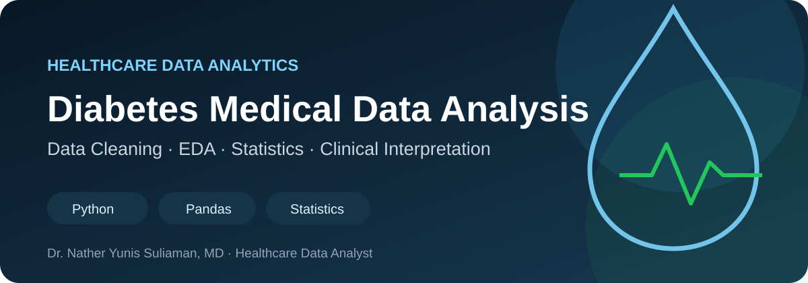

# 🩸 Diabetes Medical Data Analysis

### Healthcare Data Cleaning, EDA & Statistical Analysis | Dr. Natheer Soliman, MD

A reproducible healthcare data analysis project focused on cleaning, exploring, and interpreting clinical variables associated with diabetes.

## 🎯 Project Objective

Demonstrate a practical healthcare analytics workflow: identify data-quality issues, apply clinically informed preprocessing, explore patterns, test group differences, and communicate findings with appropriate clinical caution.

## 📊 Dataset

The dataset contains **768 observations and 9 variables**, including glucose, blood pressure, BMI, insulin, age, pregnancies, diabetes pedigree function, and the binary diabetes outcome.

### Data provenance status

The file in this repository has the structure commonly associated with the 768-row Pima diabetes dataset. However, the exact upstream source, citation, and redistribution license have not yet been verified from the repository history.

**Portfolio decision:** the analysis remains available on GitHub, but the CSV will not be republished to Kaggle until provenance and redistribution rights are confirmed. A future Kaggle version should attach an authorized original dataset rather than upload an unattributed copy.

## 🔎 Analysis Workflow

1. **Data understanding** — inspect shape, data types, descriptive statistics, and missingness.
2. **Clinically informed cleaning** — treat selected zero-coded physiological measurements in `Glucose`, `BloodPressure`, `SkinThickness`, `Insulin`, and `BMI` as likely missing/unrecorded values.
3. **Median imputation** — replace those missing values using column medians for this exploratory analysis while preserving the untouched source data separately.
4. **Outlier review** — flag potential extreme observations using box plots and IQR diagnostics without automatically capping or deleting clinically plausible values.
5. **Exploratory data analysis** — examine outcome distribution, feature distributions, correlations, and relationships with diabetes status.
6. **Statistical testing** — compare outcome groups with Welch's independent-samples t-tests, report effect sizes, and apply Benjamini–Hochberg FDR correction across feature tests.

## 📈 Visual Analysis

The published notebook generates several portfolio-ready views from the project data:

- Box plots for numerical predictors
- Correlation heatmap
- Diabetes outcome distribution
- Histograms for numerical features
- Violin plots comparing features by outcome
- Pairwise relationship plots colored by outcome

Selected exported notebook figures can be added here as repository assets after execution so the README stays tied to reproducible project outputs.

## 🔬 Analytical Focus

- `Glucose` is a central feature to inspect in relation to diabetes outcome.
- BMI, age, pregnancies, insulin, blood pressure, and diabetes pedigree information are interpreted as part of a multivariable clinical picture rather than in isolation.
- Statistical evidence is reported alongside effect size and corrected for multiple testing.
- The analysis is exploratory: association does not imply causation.

## ✅ Reproducibility

The repository includes a **GitHub Actions verification workflow** that installs dependencies and executes the entire notebook from a clean environment on every relevant push or pull request. This helps detect missing imports, broken paths, execution-order errors, and other reproducibility problems automatically.

## 🩺 Clinical Interpretation

The project highlights how data-quality decisions can materially affect healthcare analysis. The original dataset is preserved separately in the notebook, preprocessing decisions are documented, and potential outliers are reviewed rather than automatically altered.

The findings are intended to demonstrate healthcare analytics skills, not to provide diagnosis or individual clinical risk assessment.

## 🧰 Tech Stack

`Python` · `Pandas` · `NumPy` · `Matplotlib` · `Seaborn` · `SciPy` · `Jupyter / Google Colab` · `GitHub Actions`

## 📁 Repository Contents

- [`diabetes_analysis.ipynb`](./diabetes_analysis.ipynb) — complete analysis notebook
- [`diabetes.csv`](./diabetes.csv) — source dataset
- [`requirements.txt`](./requirements.txt) — Python dependencies
- [`.github/workflows/notebook-ci.yml`](./.github/workflows/notebook-ci.yml) — automated notebook verification
- [`assets/`](./assets) — project visual assets

## ⚠️ Limitations

- The notebook uses an observational dataset and cannot establish causality.
- Single median imputation does not represent uncertainty in missing measurements.
- Statistical significance does not necessarily imply clinical significance.
- Outlier handling in real-world clinical work should be informed by source documentation and clinical context.
- If predictive modeling is added, preprocessing must be fitted inside the training/cross-validation pipeline to avoid data leakage.
- Any clinical predictive use would require appropriate validation, calibration assessment, and clinical oversight.

## 👨‍⚕️ Author

**Dr. Natheer Soliman, MD**  
Healthcare Data Analyst | Clinical Data & AI
